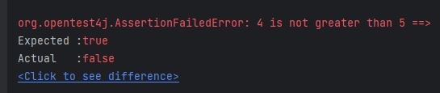

JUnit provides various assertions to test out different conditions. The most common ones
are `assertEquals`, `assertThat` and `assertTrue`, but there are some variations of them which we will cover in this
tutorial.

## Introduction

In JUnit 5, we have `org.junit.jupiter.api.Assertions` class which provides various static methods used to assert or
verify certain conditions in JUnit tests. The common syntax for assertions will look like below.

```java
assertionMethod(String expectedValue,String actualValue)
```

These methods are heavily overloaded and can work on various data types and they also have optional third parameter
of `message` which can be displayed if the assertion does not succeed.

## Available Assertions

*Below* are the most common assertions we can use.

- **assertEquals(expected, actual, message)**

  This assertion verifies that expected and actual values are equal. This can be applied on all primitives including
  String data types.
- **assertTrue(boolean condition)**

  This asserts that the supplied boolean condition is `true`.

- **assertFalse(boolean condition)**

  This asserts that the supplied boolean condition is `false`.
- **assertNull(Object actual)**

  Assert that `actual` object is `null`.
- **assertNotNull(Object actual)**

  Assert that `actual` is not `null`.

- **assertSame(obj1, obj2)**

  asserts whether two objects `obj1` and `obj2` are exactly same instance in memory. These objects can be of any type.
- **assertNotSame(obj1, obj2)**

  asserts whether two objects are not exactly same in memory.

- **assertThrows(exception, executable)**

  asserts that the second argument execution results in exception of class specified by first argument. The second
  argument has to be executable code, usually lambda expression involving method under test.

- **assertDoesNotThrows(executable)**

  asserts that the execution of `executable` does not result in exception.

- **assertArrayEquals(expected, actual)**

  asserts that the `actual` array is equal to `expected` array. This checks for array elements in the same order.
- **assertIterableEquals(expected, actual)**

  asserts that the `actual` iterable is equal to `expected` iterable. This checks for elements in the same order.

## Practical Examples

Let's see some examples of these. Although I have hardcoded values `actual` values, you can assume those values coming
from some function.

Just for demonstration, I have defined this source class as one of the example.

```java
public class Assertion {
  public static boolean greaterThanFive(int value) {
    return value > 5;
  }

  public static int divide(int num1, int num2) {
    return num1 / num2;
  }
}
```

### `assertTrue` and `assertFalse`

There are also several overloaded versions of this
method which can be used for different parameters.

These include below methods.

```java
assertTrue(boolean condition)
assertTrue(boolean condition,String message)
assertTrue(Supplier<Boolean> condition)
assertTrue(Supplier<Boolean> condition,String message)
assertTrue(BooleanSupplier condition)
assertTrue(BooleanSupplier condition,String message)
```

Similarly, there are multiple overloaded versions of `assertFalse` method.

The test class has the corresponding methods to test boolean values.

```java
public class AssertionTest {
  @Test
  void testBooleansWithoutMessage() {
    assertTrue(true);
    assertFalse(false);
    int value = 6;
    // supplier is used to avoid unnecessary computation
    assertTrue(Assertion.greaterThanFive(value));
    assertTrue("bar".equals("bar")); // not ideal, use assertEquals
  }

  @Test
  void testBooleansWithMessage() {
    assertTrue(true, "This should pass");
    assertFalse(false, "This should pass");
    int value = 6;
    // supplier with message
    assertTrue(Assertion.greaterThanFive(value), String.format("%d is not greater than 5", value));
    assertTrue("bar".equals("bar"), "This should pass"); // not ideal, use assertEquals
  }
}
```

As you can see on line 7, I have added one extra parameter of custom message which gets displayed when the test case
fails. For example, if I modify `value` to be `4` and execute this test, I get below message.



### `assertNull` and `assertNotNull`

These methods also have various overloaded versions.

```java
assertNull(Object actual)
assertNull(Object actual, String message)
assertNotNull(Object actual, Supplier<String> messageSupplier)
```

```java
public class AssertionTest {
    @Test
    void testNull() {
        assertNull(null);
        assertNotNull(new String("Hello"));
        assertNull(null, "This should be null");
    }
}
```

### `assertEquals` and `assertNotEquals`

Again, we have three overloaded versions of these methods. Below example should help clarify this.

```java
@Test
void testPrimitives() {
    assertEquals(1, 1);
    assertEquals(1.2, 1.2);
    assertEquals(1, 1.0);
    assertNotEquals(1.0, 0.99);
    assertEquals('a', 'a');
    assertNotEquals('a', 'A', "Lowercase a is not equal to uppercase A");
    assertEquals('a', 97);
}
```

### `assertSame` and `assertNotSame`

Here is an example of `assertSame` and `assertNotSame` methods.

```java
@Test
void testAssertSame() {
    String str = "foo";
    String str2 = str;
    assertSame(str, str2, "Strings are same");
    String str3 = new String("foo");
    assertNotSame(str, str3, "Strings are not same");
}
```

### `assertArrayEquals`

This method is used to compare two arrays. It checks if the arrays are equal in terms of length and elements. The 
order of elements is also verified.

```java
@Test
void testArrays() {
    int[] nums = {1,2,3};
    int[] nums2 = {1,2,3};
    assertArrayEquals(nums, nums2);
    assertNotSame(nums, nums2); // not same object
    nums2 = new int[]{2,3,1};
//        assertArrayEquals(nums, nums2); // checks orders too
}
```

### `assertIterableEquals`

This method is used to compare two iterables. It checks the elements and the order of elements just like `assertArrayEquals`.

```java
@Test
void testIterables() {
    Iterable<String> list1 = List.of("foo", "bar");
    Iterable<String> list2 = List.of("foo", "bar");
    assertIterableEquals(list1, list2, "Two lists are equal");
}
```

### `assertAll`

This method is used to group multiple assertions together. This is useful when you want to assert multiple conditions.

```java
@Test
void testAssertAll() {
    assertAll(
        () -> assertTrue(true),
        () -> assertFalse(false),
        () -> assertEquals("foo", "foo")
    );
    assertAll(
        () -> assertTrue(true, "This should pass"),
        () -> assertFalse(false, "This should pass"),
        () -> assertEquals("foo", "foo", "This should pass")
    );
}
```

### `assertThrows`, `assertDoesNotThrow` and `assertThrowsExactly`

These methods are used to assert that the code block throws an exception or not. The `assertThrows` method is used 
to check if the code block throws an exception of the specified type. The `assertDoesNotThrow` method is used to 
check if the code block does not throw any exception. The `assertThrowsExactly` method is used to check if the code 
block throws an exception of the exact type. In this case, the parent class of the exception is not considered the same.

```java
@Test
void testThrows() {
    assertThrows(ArithmeticException.class, () -> Assertion.divide(2,0));
    assertDoesNotThrow(() -> Assertion.divide(4,2));
    assertThrowsExactly(ArithmeticException.class, () -> Assertion.divide(2,0));
    assertThrows(RuntimeException.class, () -> Assertion.divide(2,0));
//    assertThrowsExactly(RuntimeException.class, () -> Assertion.divide(2,0)); // fail
}
```

Below is a complete code for this class, which has methods for testing various data types with above assertions.

```java
import org.junit.jupiter.api.Disabled;
import org.junit.jupiter.api.Test;

import java.util.List;

import static org.junit.jupiter.api.Assertions.*;

public class AssertionTest {
  @Test
  void testBooleansWithoutMessage() {
    assertTrue(true);
    assertFalse(false);
    int value = 6;
    // supplier is used to avoid unnecessary computation
    assertTrue(Assertion.greaterThanFive(value));
    assertTrue("bar".equals("bar")); // not ideal, use assertEquals
  }

  @Test
  void testBooleansWithMessage() {
    assertTrue(true, "This should pass");
    assertFalse(false, "This should pass");
    int value = 6;
    // supplier with message
    assertTrue(Assertion.greaterThanFive(value), String.format("%d is not greater than 5", value));
    assertTrue("bar".equals("bar"), "This should pass"); // not ideal, use assertEquals
  }

  @Test
  void testStrings() {
    assertEquals("foo", "foo");
    assertNotEquals("foo", "bar");
    assertSame("foo", "foo");
//        assertSame(new String("foo"), new String("foo"));
  }

  @Test
  void testPrimitives() {
    assertEquals(1, 1);
    assertEquals(1.2, 1.2);
    assertEquals(1, 1.0);
    assertNotEquals(1.0, 0.99);
    assertEquals('a', 'a');
    assertNotEquals('a', 'A', "Lowercase a is not equal to uppercase A");
    assertEquals('a', 97);
  }

  @Test
  void testNull() {
    assertNull(null);
    assertNotNull(new String("Hello"));
    assertNull(null, "This should be null");
  }

  @Test
  void testAssertSame() {
    String str = "foo";
    String str2 = str;
    assertSame(str, str2, "Strings are same");
    String str3 = new String("foo");
    assertNotSame(str, str3, "Strings are not same");
  }

  @Test
  void testArrays() {
    int[] nums = {1,2,3};
    int[] nums2 = {1,2,3};
    assertArrayEquals(nums, nums2);
    assertNotSame(nums, nums2, "Two arrays are equal"); // not same object
    nums2 = new int[]{2,3,1};
//        assertArrayEquals(nums, nums2); // checks orders too
  }

  @Test
  void testIterables() {
    Iterable<String> list1 = List.of("foo", "bar");
    Iterable<String> list2 = List.of("foo", "bar");
    assertIterableEquals(list1, list2, "Two lists are equal");
  }

  @Test
  void testAssertAll() {
    assertAll(
            () -> assertTrue(true),
            () -> assertFalse(false),
            () -> assertEquals("foo", "foo")
    );
    assertAll(
            () -> assertTrue(true, "This should pass"),
            () -> assertFalse(false, "This should pass"),
            () -> assertEquals("foo", "foo", "This should pass")
    );
  }

  @Test
  void testThrows() {
    assertThrows(ArithmeticException.class, () -> Assertion.divide(2,0));
    assertDoesNotThrow(() -> Assertion.divide(4,2));
    assertThrowsExactly(ArithmeticException.class, () -> Assertion.divide(2,0));
    assertThrows(RuntimeException.class, () -> Assertion.divide(2,0));
//        assertThrowsExactly(RuntimeException.class, () -> Assertion.divide(2,0)); // fail
  }

//    @Test
//    void futureFeature() {
//        fail("Not implemented");
//    }

  @Disabled
  @Test
  void disabledTest() {
    fail("This test is disabled");
  }
}
```

### Not implemented Tests

This is all good, but what if we have not yet implemented a testcase and want to be reminded of that before we merge it.
If we have a feature that we are planning to add or something that we have added but we have not written a unit test,
then we can write a skeleton of the method we want to test and inside the method, we can make the unit test fail
using `fail()` method as shown in example below. Ideally in TDD, it's standard practice to first write unit test before
implementing any feature, but in case you may see this kind of requirement.

```java
@Test
void futureFeature(){
        fail("Not implemented");
        }
```

If you want to purposefully disable execution of a test, you can use `@Disabled` annotation on the method. The
difference is that it will not fail the test, but it will not be executed at all.

```java
@Disabled
@Test
void disabledTest(){
        fail("This test is disabled");
        }
```